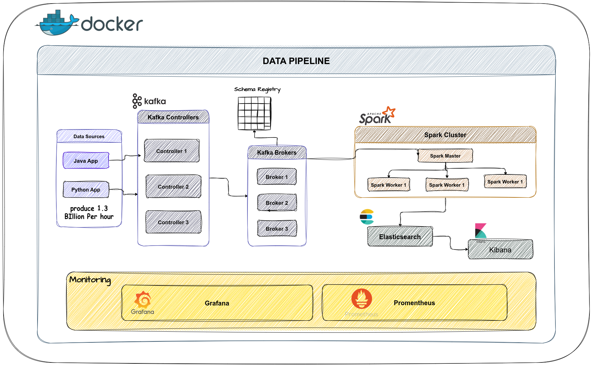

# StreamFlow 

> A production-grade, fully containerized real-time financial transaction streaming pipeline — built to simulate, process, detect anomalies, store, and monitor high-throughput event data at scale.



---

## Table of Contents

1. [What is StreamFlow?](#what-is-streamflow)
2. [Why I Built This](#why-i-built-this)
3. [Architecture Overview](#architecture-overview)
4. [Stack](#stack)
5. [Quick Start](#quick-start)
6. [Project Structure](#project-structure)
7. [Component Guides](#component-guides)
8. [Tech Decisions & Tradeoffs](#tech-decisions--tradeoffs)
9. [Known Limitations](#known-limitations)
10. [Storage Capacity Planning](#storage-capacity-planning)
11. [Service URLs](#service-urls)
12. [Notes](#notes)

---

## What is StreamFlow?

StreamFlow is a complete end-to-end data streaming platform that simulates a real-world financial transaction processing system. It was designed to demonstrate the integration of modern data engineering technologies at production-level scale — all running locally inside a single Docker Compose environment.

The platform handles everything from event generation and Kafka ingestion, through real-time Spark Structured Streaming, to Elasticsearch storage, Kibana visualization, and a full Grafana + Prometheus observability stack.

Two synthetic producers publish financial transactions to a Kafka topic at high throughput. A PySpark job consumes those events in parallel, runs windowed aggregations per merchant, and flags anomalous high-value transactions — both outputs are written back to dedicated Kafka topics. A separate observability layer scrapes JMX metrics from every Kafka broker, controller, and Spark master, rendering them in a live Grafana dashboard.

---

## Why I Built This

I built StreamFlow to bridge the gap between reading about distributed streaming systems and actually running one. The goal was to get hands-on experience with every layer of a real-time data pipeline — producer configuration, Kafka KRaft mode (no ZooKeeper), Spark Structured Streaming with exactly-once semantics, anomaly detection in flight, and production-grade observability.

Along the way, I also wanted to validate real capacity planning numbers: how much storage does 1.3 billion simulated events per hour actually cost after Kafka compression and replication? The `Storage.md` document answers that with a Monte Carlo simulation over 1 million events. That kind of end-to-end thinking — from byte-level schema analysis to petabyte-scale 5-year forecasts — is what makes StreamFlow more than just a "hello Kafka" demo.

---

## Architecture Overview

```
┌─────────────────────────────────────────────────────────────────┐
│                        DATA PRODUCERS                           │
│   Java Producer (high throughput)  │ Python Producer (anomalies)│
└───────────────────┬────────────────┴────────────────────────────┘
                    │  financial_transactions (16 partitions, RF=3)
                    ▼
┌─────────────────────────────────────────────────────────────────┐
│                   APACHE KAFKA (KRaft mode)                     │
│   3 Controllers (Raft quorum)  ·  3 Brokers  ·  Schema Registry │
│   Redpanda Console UI                                           │
└───────────────────┬─────────────────────────────────────────────┘
                    │
                    ▼
┌─────────────────────────────────────────────────────────────────┐
│                  APACHE SPARK 3.5 (Structured Streaming)        │
│   spark-master  +  3 workers                                    │
│                                                                 │
│   ┌─────────────────────────┐  ┌──────────────────────────────┐ │
│   │  Aggregation Query      │  │  Anomaly Detection Query     │ │
│   │  5-min windowed SUM +   │  │  Filter: amount > $140,000   │ │
│   │  COUNT per merchant     │  │  Output mode: append         │ │
│   │  Output mode: update    │  │                              │ │
│   └───────────┬─────────────┘  └──────────────┬───────────────┘ │
└───────────────┼────────────────────────────────┼────────────────┘
                │                                │
                ▼                                ▼
      transaction_aggregates          transaction_anomalies
                │                                │
                └────────────────┬───────────────┘
                                 ▼
┌─────────────────────────────────────────────────────────────────┐
│              ELASTICSEARCH 8.12  +  KIBANA                      │
│              Search, indexing & visualization                   │
└─────────────────────────────────────────────────────────────────┘

┌─────────────────────────────────────────────────────────────────┐
│              OBSERVABILITY (cross-cutting)                      │
│   JMX Exporter (brokers + controllers + Spark master)           │
│   Prometheus 3.0  →  Grafana 10.4  StreamFlow Dashboard         │
│   Alertmanager — Kafka + Elasticsearch alert rules              │
└─────────────────────────────────────────────────────────────────┘
```

**Two streaming queries run in parallel inside the same Spark job:**

| Query | Logic | Output Mode | Trigger |
|---|---|---|---|
| Aggregates | 5-min windowed `SUM` + `COUNT` per merchant, 10-min watermark | `update` | every 10s |
| Anomalies | Pass-through filter `amount > $140,000` | `append` | every 10s |

---

## Stack

| Component | Version | Purpose |
|---|---|---|
| Apache Kafka | 3.8.1 | Distributed message broker — KRaft mode, no ZooKeeper |
| Confluent Schema Registry | 7.5.1 | Schema management (Avro/Protobuf ready) |
| Redpanda Console | 2.5.2 | Kafka topic & consumer group UI |
| Apache Spark | 3.5.0 | Structured Streaming engine |
| Elasticsearch | 8.12.0 | Search & analytics sink |
| Kibana | 8.12.0 | Elasticsearch UI |
| Prometheus | 3.0.0 | Metrics collection & storage |
| Alertmanager | 0.27.0 | Alert routing (email / Slack / webhook) |
| Grafana | 10.4.0 | Metrics dashboards |
| JMX Exporter | 0.20.0 | Kafka & Spark JVM → Prometheus bridge |

---

## Quick Start

### Prerequisites

- Docker ≥ 24
- Docker Compose ≥ 2.20
- 8 GB RAM available for Docker
- `curl` installed on host
- Python 3.10+ (for Python producer)
- JDK 11+ (for Java producer)

### 1. Clone the repo

```bash
git clone https://github.com/keroloshany47/StreamFlow.git
cd StreamFlow
```

### 2. Download JMX Exporter jar

```bash
curl -L https://repo1.maven.org/maven2/io/prometheus/jmx/jmx_prometheus_javaagent/0.20.0/jmx_prometheus_javaagent-0.20.0.jar \
  -o volumes/jmx_exporter/jmx_prometheus_javaagent.jar
```

### 3. Create required directories

```bash
mkdir -p jobs mnt/checkpoints mnt/spark-state
```

### 4. Start the full stack

```bash
docker compose up -d
```

### 5. Verify everything is up

```bash
docker compose ps
curl http://localhost:9200/_cluster/health?pretty
```

### 6. Run the Java producer (high throughput)

```bash
./gradlew run 
```

### 7. Run the Python producer (anomaly traffic)

```bash
cd Python_producer
pip install -r ../requirements.txt
python Python_Producer.py
```

### 8. Submit the Spark streaming job

```bash
docker exec -it spark-master /opt/spark/bin/spark-submit \
  --master spark://spark-master:7077 \
  --conf spark.jars.ivy=/tmp/ivy \
  --packages org.apache.spark:spark-sql-kafka-0-10_2.12:3.5.0 \
  /opt/spark/jobs/spark_processor.py
```

### Stop

```bash
docker compose down
# Full reset including volumes:
docker compose down -v
```

---

## Project Structure

```
StreamFlow/
│
├── docker-compose.yml              # Full stack — Kafka, Spark, ES, Prometheus, Grafana
├── README.md                       # ← you are here
├── requirements.txt                # Python dependencies
│
├── docs/ 
│   └──Storage.md                      # Kafka storage capacity planning (Monte Carlo)
│
├── src/                            # Java producer
│   ├── main/java/com/datamasterylab/
│   │   ├── TransactionProducer.java  # Entry point, threading, Kafka config
│   │   └── dto/Transaction.java      # Data model + random generator
│   └── README.md
│
├── Python_producer/                # Python producer (anomaly traffic)
│   ├── Python_Producer.py
│   └── README.md
│
├── jobs/                           # PySpark streaming job
│   ├── spark_processor.py
│   └── README.md
│
├── monitoring/                     # Full observability stack
│   ├── prometheus/
│   │   ├── prometheus.yml
│   │   └── rules/alert_rules.yml
│   ├── alertmanager/alertmanager.yml
│   ├── grafana/
│   │   ├── provisioning/datasources/datasources.yml
│   │   └── dashboards/StreamFlow_dashboard.json
│   └── README.md
│
├── volumes/
│   └── jmx_exporter/               # JMX Exporter jar + kafka-broker.yml config
│
├── Imgs/                           # Architecture diagrams & screenshots
│   ├── streamflow_drawio.png
│   ├── Grafana.png
│   ├── Prometheus.png
│   ├── spark_jobs_active.png
│   ├── spark_jobs_completed.png
│   ├── aggregates_query.png
│   └── anomalies_query.png
│
└── mnt/
    ├── checkpoints/                # Spark checkpoint storage (auto-created)
    └── spark-state/                # Stateful aggregation store (auto-created)
```

---

## Component Guides

| Component | README |
|---|---|
| Java Producer | [src/README.md](src/README.md) |
| Python Producer | [Python_producer/README.md](Python_producer/README.md) |
| Spark Streaming Job | [jobs/README.md](jobs/README.md) |
| Monitoring & Observability | [monitoring/README.md](monitoring/README.md) |
| Storage Capacity Planning | [Storage Capacity Planning](docs/storage-capacity.md) |
| volumes/jmx_exporter| [volumes/jmx_exporter](volumes/jmx_exporter/README.md) |

---

## Tech Decisions & Tradeoffs

### Kafka KRaft mode (no ZooKeeper)

Kafka 3.8.1 runs in KRaft mode with a dedicated 3-node controller quorum, eliminating the ZooKeeper dependency entirely. This simplifies the deployment significantly — one less distributed system to manage — and aligns with Kafka's long-term direction. The tradeoff is that some older tooling and client libraries may still expect ZooKeeper; none of the tools used here have that limitation.

### JSON over Avro

Transactions are serialized as compact JSON rather than Avro or Protobuf. JSON was chosen for readability and ease of debugging during development. The Schema Registry is included in the stack and ready to use — migrating to Avro would yield a 60–80% payload reduction and is listed as an optimization opportunity in `Storage.md`. For a production system, Avro would be the right call.

### LocalExecutor over CeleryExecutor for Spark

Spark runs with a standalone cluster (1 master + 3 workers) rather than YARN or Kubernetes. This keeps the Docker resource footprint manageable on a local machine. The `spark.sql.shuffle.partitions` is set to 200 (default) in the code — the jobs/README.md notes it should be reduced to 4 for local runs to avoid partition overhead.

### Python + Java producers running in tandem

Two producers are intentional: the Java producer (snappy compression, CPU-core threads) saturates the topic with normal-range transactions ($10–$510), while the Python producer ($50k–$150k range) deliberately crosses the $140k anomaly threshold frequently. This gives a realistic mixed traffic pattern for testing both the aggregation and anomaly detection paths end-to-end.

### `acks=1` on both producers

Both producers use `acks=1` (leader acknowledgment only) for maximum throughput. This is a durability tradeoff — a broker failure between leader write and follower replication could lose the in-flight batch. For a production financial system, `acks=all` with `min.insync.replicas=2` would be required. Here it's a deliberate choice for throughput benchmarking.

---

## Known Limitations

**Resource-constrained local environment:** The full stack (3 Kafka brokers, 3 controllers, 3 Spark workers, Elasticsearch, Kibana, Prometheus, Grafana) is demanding. On machines with less than 16 GB of RAM, it's recommended to reduce Spark worker count or stop Elasticsearch/Kibana when focusing on the streaming pipeline.

**`shuffle.partitions` not tuned in code:** `spark_processor.py` currently sets `spark.sql.shuffle.partitions` to 200 (the default). This is documented in jobs/README.md but left in the code as-is. Running with 200 shuffle partitions on a 3-worker local cluster causes unnecessary overhead and slows batch processing significantly.

**Elasticsearch security disabled:** `xpack.security` is disabled for local development convenience. This must be enabled before any production or non-local deployment.

**Grafana anonymous access enabled:** `GF_AUTH_ANONYMOUS_ENABLED=true` allows anonymous viewer access — not appropriate for any shared or production environment.

**`isInternational` stored as string:** The Python producer serializes this field as `"True"`/`"False"` (strings) rather than native JSON booleans. The Spark job corrects this at ingestion time, but the schema inconsistency wastes ~4–5 bytes per event (~49 TB/year at simulated scale). A one-line fix is documented in `Storage.md`.

**Simulated throughput:** The 1.3 billion events/hour figure in `Storage.md` is a theoretical capacity planning target used to project infrastructure requirements, not a number achieved in the local environment. Actual measured throughput in the local Docker setup is approximately 300,000 records/sec from the Java producer.

---

## Storage Capacity Planning

See [Storage Capacity Planning](docs/storage-capacity.md) for the full Monte Carlo–validated capacity analysis, including:
- Field-by-field payload size breakdown
- Kafka overhead + compression + replication calculations
- 5-year storage forecast at 20% annual growth (reaching ~17.76 PB)
- Sensitivity analysis across compression scenarios
- Optimization opportunities (schema migration to Avro, boolean fix, etc.)

---

## Service URLs

| Service | URL | Credentials |
|---|---|---|
| Redpanda Console | http://localhost:8085 | — |
| Schema Registry | http://localhost:18081 | — |
| Spark Master UI | http://localhost:9190 | — |
| Spark App UI | http://localhost:4040 | — |
| Kibana | http://localhost:5601 | — |
| Elasticsearch | http://localhost:9200 | — |
| Prometheus | http://localhost:9090 | — |
| Grafana | http://localhost:3000 | admin / admin |
| Alertmanager | http://localhost:9093 | — |

---

## Kafka Connectivity

| From | Bootstrap Servers |
|---|---|
| Inside Docker (Spark, Schema Registry) | `kafka-broker-1:9092,kafka-broker-2:9092,kafka-broker-3:9092` |
| From host machine (producers) | `localhost:29092,localhost:39092,localhost:49092` |

---

## Notes

- The JMX Exporter jar is excluded from git — download it manually per the Quick Start above.
- Spark checkpoint data lives in `mnt/checkpoints/` — delete this folder for a clean restart.
- Prometheus retains 7 days of metrics by default; adjust `--storage.tsdb.retention.time` in `docker-compose.yml` if needed.
- All Kafka PromQL queries use `sum by (instance)` to prevent duplicate series from per-topic metric exports.

---

