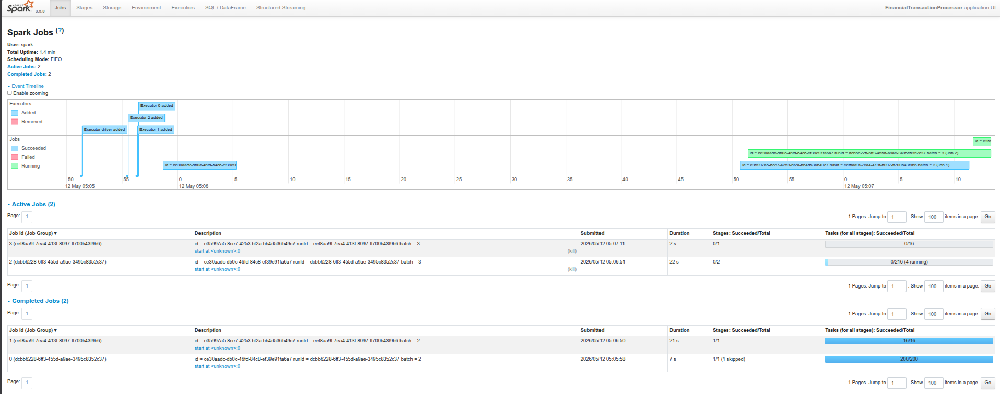
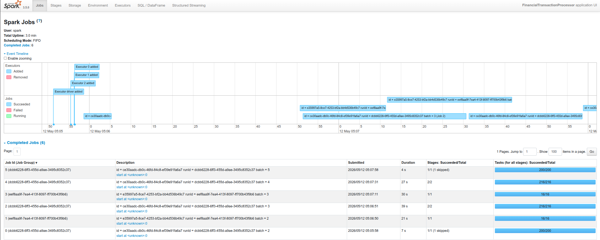
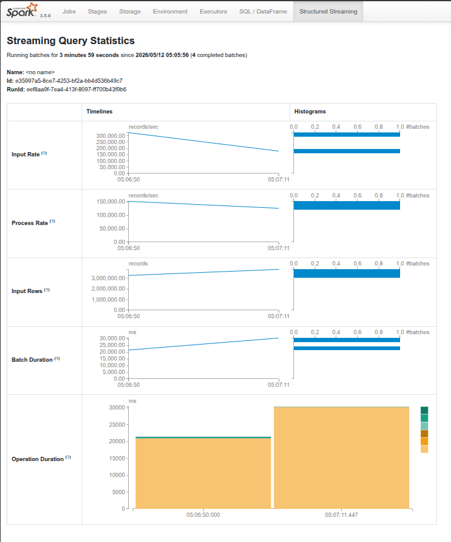
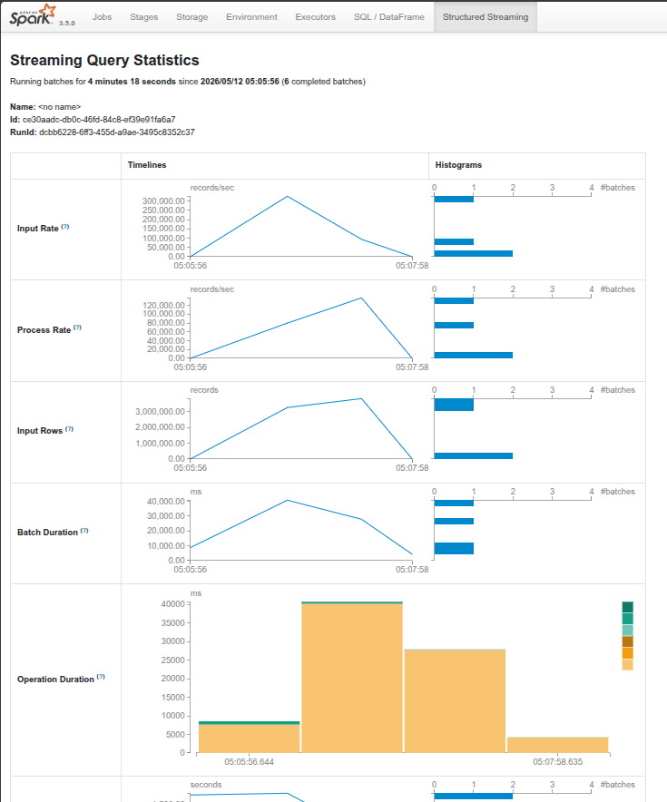

# Spark Streaming Jobs

Real-time financial transaction processing using Apache Spark Structured Streaming. This layer sits between the Kafka brokers and downstream consumers, running two parallel streaming queries — one for merchant-level windowed aggregations and one for high-value anomaly detection.

---

## Table of Contents

1. [How It Works](#how-it-works)
2. [Performance](#performance)
3. [Prerequisites](#prerequisites)
4. [How to Run](#how-to-run)
5. [Configuration Reference](#configuration-reference)
6. [Schema](#schema)
7. [Checkpointing & Fault Tolerance](#checkpointing--fault-tolerance)
8. [Troubleshooting](#troubleshooting)
9. [File Structure](#file-structure)

---

## How It Works

```
Kafka Topic: financial_transactions
  (16 partitions · replication factor 3)
          │
          ▼
  spark_processor.py
  (Spark Structured Streaming)
          │
          ├──▶  Kafka Topic: transaction_aggregates
          │     5-min windowed SUM + COUNT per merchant
          │     Output mode: update  ·  Trigger: every 10s
          │
          └──▶  Kafka Topic: transaction_anomalies
                Filter: amount > $140,000
                Output mode: append  ·  Trigger: every 10s
```

Both queries share a single Spark session and run concurrently. Spark reads from `financial_transactions` using `startingOffsets=earliest` so a fresh start will replay all available history before catching up to live data.

---

## Performance

Metrics captured from Spark UI (`localhost:4040`) during a live run:

| Metric | Value |
|---|---|
| Input Rate | ~300,000 records/sec |
| Process Rate | ~120,000–150,000 records/sec |
| Records per Batch | ~3,000,000 |
| Batch Duration | ~10,000–40,000 ms |
| Executors | 3 workers + 1 driver |
| Scheduling Mode | FIFO |

### Active Jobs Timeline


### Completed Jobs Timeline


### Streaming Query Stats — Aggregates


### Streaming Query Stats — Anomalies


---

## Prerequisites

- Docker + Docker Compose running
- The full StreamFlow stack healthy (`docker compose ps`)
- Kafka brokers reachable on internal hostnames (`kafka-broker-1:9092`, etc.)
- At least one producer publishing to `financial_transactions`

---

## How to Run

### 1. Start the stack

```bash
docker compose up -d
```

Wait ~30 seconds for brokers to be ready:

```bash
docker compose ps   # all services should show "Up"
```

### 2. Start a producer

**Java producer (high throughput):**
```bash
./gradlew run
```

**Python producer (anomaly traffic):**
```bash
cd Python_producer
python Python_Producer.py
```

> Run both simultaneously for a realistic mixed traffic pattern.

### 3. Submit the Spark job

```bash
docker exec -it spark-master /opt/spark/bin/spark-submit \
  --master spark://spark-master:7077 \
  --conf spark.jars.ivy=/tmp/ivy \
  --packages org.apache.spark:spark-sql-kafka-0-10_2.12:3.5.0 \
  /opt/spark/jobs/spark_processor.py
```

### 4. Monitor

| UI | URL |
|---|---|
| Spark Master | http://localhost:9190 |
| Structured Streaming Stats | http://localhost:4040 → Structured Streaming tab |
| Output Topics | http://localhost:8085 (Redpanda Console) |

---

## Configuration Reference

All config lives at the top of `spark_processor.py`:

```python
KAFKA_BROKERS    = 'kafka-broker-1:9092,kafka-broker-2:9092,kafka-broker-3:9092'
SOURCE_TOPIC     = 'financial_transactions'
AGGREGATES_TOPIC = 'transaction_aggregates'
ANOMALIES_TOPIC  = 'transaction_anomalies'

CHECKPOINT_DIR   = '/mnt/spark-checkpoints'
STATES_DIR       = '/mnt/spark-state'
```

> **Important:** Always use internal Docker hostnames (`kafka-broker-N:9092`) inside the container. The producers run on the host and use `localhost:29092` — Spark is inside Docker and cannot resolve `localhost` the same way.

### Spark Session Tuning

```python
.config("spark.sql.shuffle.partitions", 200)  # ⚠ Reduce to 4 for local runs
.config("spark.executor.memory", "512m")
.config("spark.driver.memory", "512m")
```

> **Note:** `shuffle.partitions` defaults to 200 in the codebase. On a local 3-worker setup this creates massive overhead. **Set it to 4 for local development** — the default is left as-is to reflect the value you'd tune in a real cluster.

### Aggregation Window

```python
.withWatermark("transactionTimestamp", "10 minutes")  # tolerate 10 min late data
.groupBy(
    window(col("transactionTimestamp"), "5 minutes"),  # 5-min tumbling window
    col("merchantId")
)
```

### Anomaly Threshold

```python
anomalies_df = transactions_df.filter(col("amount") > 140000)
```

Change `140000` to tune detection sensitivity. The Python producer intentionally generates amounts in the $50k–$150k range to cross this threshold frequently.

---

## Schema

Incoming JSON from Kafka:

```python
StructType([
    StructField('transactionId',   StringType()),   # UUID v4
    StructField('userId',          StringType()),   # user_N
    StructField('merchantId',      StringType()),   # merchant_N
    StructField('amount',          DoubleType()),   # 10.0 – 150,000.0
    StructField('transactionTime', LongType()),     # epoch ms → converted to timestamp
    StructField('transactionType', StringType()),   # purchase / refund
    StructField('location',        StringType()),
    StructField('paymentMethod',   StringType()),
    StructField('isInternational', StringType()),   # "True"/"False" → converted to Boolean
    StructField('currency',        StringType()),   # USD / EUR / GBP
])
```

Two transformations are applied after parsing:
- `transactionTime` (epoch ms) → `transactionTimestamp` (Spark timestamp)
- `isInternational` ("True"/"False" string) → native boolean

---

## Checkpointing & Fault Tolerance

Checkpoints are stored in `./mnt/checkpoints/` (mounted into the container at `/mnt/spark-checkpoints`):

```
mnt/checkpoints/
├── aggregates/   ← Kafka offsets + state deltas for aggregation query
└── anomalies/    ← Kafka offsets for anomaly query
```

If the Spark job crashes and restarts, it automatically resumes from the last committed offset — no data loss, no duplicates (exactly-once within the streaming engine).

To do a clean restart (wipe checkpoints and replay from beginning):

```bash
rm -rf mnt/checkpoints/aggregates mnt/checkpoints/anomalies
```

---

## Troubleshooting

### Spark can't connect to Kafka

**Symptom:** `Connection to node -1 (localhost/127.0.0.1:29092) could not be established`

**Cause:** `KAFKA_BROKERS` is set to `localhost` — correct for the host machine, wrong inside Docker.

**Fix:** Ensure `spark_processor.py` uses internal hostnames:
```python
KAFKA_BROKERS = 'kafka-broker-1:9092,kafka-broker-2:9092,kafka-broker-3:9092'
```

---

### Machine is slow / RAM maxed out

**Fix 1:** Reduce `spark.sql.shuffle.partitions` to 4.

**Fix 2:** Scale down to 1 Spark worker in `docker-compose.yml`.

**Fix 3:** Stop services you don't need:
```bash
docker compose stop elasticsearch kibana prometheus grafana
```

---

### No data in output topics

Check in order:
1. Is a producer running? → Check terminal output for throughput logs
2. Is `financial_transactions` receiving messages? → Redpanda Console → Topics
3. Did the Spark job start without errors? → `http://localhost:4040` → Structured Streaming tab
4. Are checkpoints stale? → Delete `mnt/checkpoints/` and resubmit

---

### `spark.sql.adaptive.enabled is not supported in streaming`

This is a **warning, not an error**. Spark automatically disables AQE for streaming DataFrames. Safe to ignore.

---

## File Structure

```
jobs/
└── spark_processor.py    ← the streaming job

mnt/
├── checkpoints/
│   ├── aggregates/       ← checkpoint state for aggregation query
│   └── anomalies/        ← checkpoint state for anomaly query
└── spark-state/          ← stateful aggregation store
```
