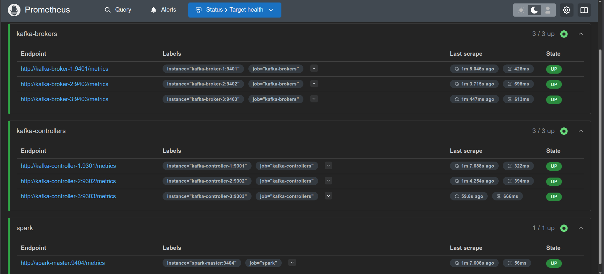
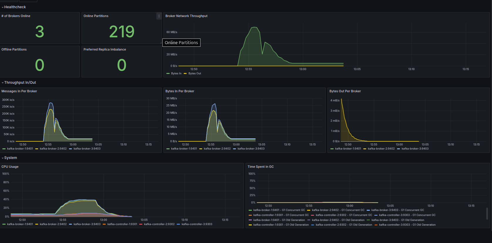

# Monitoring & Observability

Full observability stack for StreamFlow, providing real-time metrics, dashboards, and alerting across Apache Kafka, Apache Spark, and Elasticsearch.

---

## Table of Contents

1. [Architecture Overview](#architecture-overview)
2. [Stack Components](#stack-components)
3. [Quick Start](#quick-start)
4. [StreamFlow Grafana Dashboard](#streamflow-grafana-dashboard)
5. [Metrics Reference](#metrics-reference)
6. [Alert Rules](#alert-rules)
7. [Folder Structure](#folder-structure)

---

## Architecture Overview

```
┌──────────────────────────────────────────────────────────────────────────────┐
│                            StreamFlow Platform                               │
│                                                                              │
│  Kafka Brokers             JMX Exporter :9401 / :9402 / :9403               │
│  Kafka Controllers         JMX Exporter :9301 / :9302 / :9303               │
│  Spark Master              JMX Exporter :9404                                │
│  Elasticsearch             Native /_prometheus/metrics :9200                 │
│         │                                                                    │
│         └──────────────────────────────────────┐                             │
│                                                ▼                             │
│                              ┌──────────────────────────────┐                │
│                              │   Prometheus :9090           │                │
│                              │   scrape_interval: 10s       │                │
│                              │   retention: 7 days          │                │
│                              └──────────────┬───────────────┘                │
│                                             │                                │
│                              ┌──────────────▼───────────────┐                │
│                              │   Grafana :3000              │                │
│                              │   StreamFlow Dashboard       │                │
│                              │   Auto-provisioned DS        │                │
│                              │   30s auto-refresh           │                │
│                              └──────────────────────────────┘                │
└──────────────────────────────────────────────────────────────────────────────┘
```

**Data flow:** Each service exposes metrics via JMX Exporter (Kafka, Spark) or a native Prometheus endpoint (Elasticsearch). Prometheus scrapes all targets every 10–15 seconds. Grafana queries Prometheus and renders the StreamFlow Dashboard with a 30-second auto-refresh.

---

## Stack Components

| Component | Port | Scrape Interval | Purpose |
|---|---|---|---|
| **Prometheus** | `9090` | — | Metrics collection & storage (7-day retention) |
| **JMX Exporter** (brokers) | `9401–9403` | 10s | Kafka broker JVM + broker metrics |
| **JMX Exporter** (controllers) | `9301–9303` | 10s | Kafka controller metrics |
| **JMX Exporter** (Spark) | `9404` | 15s | Spark master JVM metrics |
| **Elasticsearch** | `9200` | 15s | Native `/_prometheus/metrics` endpoint |
| **Grafana** | `3000` | — | Visualization & dashboards |
| **Alertmanager** | `9093` | — | Alert routing (email / Slack / webhook) |

---

## Quick Start

### 1. Start the full stack

The monitoring stack is bundled into the main `docker-compose.yml`:

```bash
docker compose up -d
```

### 2. Verify Prometheus targets

Open [http://localhost:9090/targets](http://localhost:9090/targets) and confirm all targets show **UP**:

```
kafka-brokers       → 3/3 UP  (kafka-broker-1:9401, -2:9402, -3:9403)
kafka-controllers   → 3/3 UP  (kafka-controller-1:9301, -2:9302, -3:9303)
spark               → 1/1 UP  (spark-master:9404)
```



### 3. Open Grafana

Navigate to [http://localhost:3000](http://localhost:3000)

```
Username: admin
Password: admin
```

> The Prometheus datasource is **auto-provisioned** via `grafana/provisioning/datasources/` — no manual setup needed.

### 4. Import the StreamFlow Dashboard

**Dashboards → Import → Upload JSON file**, then select:

```
monitoring/grafana/dashboards/StreamFlow_dashboard.json
```

---

## StreamFlow Grafana Dashboard



The dashboard is organized into three sections, each auto-refreshing every **30 seconds**.

### Section 1 — Healthcheck

| Panel | PromQL | Healthy Value |
|---|---|---|
| **# of Brokers Online** | `count(kafka_server_replicamanager_leadercount{job="kafka-brokers"})` | = 3 |
| **Online Partitions** | `sum(kafka_server_replicamanager_partitioncount{job="kafka-brokers"})` | Matches topic config |
| **Offline Partitions** | `sum(kafka_controller_kafkacontroller_offlinepartitionscount)` | **Must be 0** |
| **Preferred Replica Imbalance** | `sum(kafka_controller_kafkacontroller_preferredreplicaimbalancecount)` | 0 is ideal |
| **Broker Network Throughput** | `bytesinpersec` + `bytesoutpersec` combined | Depends on load |

### Section 2 — Throughput In/Out

| Panel | PromQL | Why It Matters |
|---|---|---|
| **Messages In Per Broker** | `sum by (instance) (messagesinpersec)` | Detects uneven producer load |
| **Bytes In Per Broker** | `sum by (instance) (bytesinpersec)` | Actual data volume per broker |
| **Bytes Out Per Broker** | `sum by (instance) (bytesoutpersec)` | Consumer fetch traffic per broker |

> If one broker consistently shows higher throughput than the others, partition assignment needs rebalancing.

### Section 3 — System

| Panel | PromQL | Why It Matters |
|---|---|---|
| **CPU Usage** | `sum by (instance) (rate(process_cpu_seconds_total{job=~"kafka.*"}[5m]))` | Detects hot brokers |
| **Time Spent in GC** | `sum by (instance, gc) (rate(jvm_gc_collection_seconds_sum[5m]))` | GC pressure causes latency spikes |

> G1 Concurrent GC is normal and expected. Watch for **G1 Old Generation** spikes — they indicate the broker JVM heap needs tuning.

---

## Metrics Reference

### Kafka Broker

| Metric | Description |
|---|---|
| `kafka_server_replicamanager_leadercount` | Number of leader partitions on this broker |
| `kafka_server_replicamanager_partitioncount` | Total partitions assigned to this broker |
| `kafka_server_replicamanager_underreplicatedpartitions` | Partitions not fully replicated — alert if > 0 |
| `kafka_server_brokertopicmetrics_messagesinpersec` | Producer message rate (summed across topics) |
| `kafka_server_brokertopicmetrics_bytesinpersec` | Incoming byte rate from producers |
| `kafka_server_brokertopicmetrics_bytesoutpersec` | Outgoing byte rate to consumers |

### Kafka Controller

| Metric | Description |
|---|---|
| `kafka_controller_kafkacontroller_offlinepartitionscount` | Partitions with no active leader — **critical if > 0** |
| `kafka_controller_kafkacontroller_preferredreplicaimbalancecount` | Partitions not on their preferred leader |

### JVM (all Kafka processes)

| Metric | Description |
|---|---|
| `process_cpu_seconds_total` | CPU time consumed by the JVM process |
| `jvm_gc_collection_seconds_sum` | Time spent in GC per collector type (G1 Concurrent / Old Generation) |

### Elasticsearch

| Metric | Description |
|---|---|
| `elasticsearch_cluster_health_status{color="red"}` | Red = primary shards missing, writes failing |
| `elasticsearch_jvm_memory_used_bytes` | JVM heap currently in use |
| `elasticsearch_jvm_memory_max_bytes` | Maximum configured JVM heap |

---

## Alert Rules

All rules live in `prometheus/rules/alert_rules.yml` and are evaluated every **10 seconds**.

### Critical — Kafka Broker Down

```yaml
alert: KafkaBrokerDown
expr: up{job="kafka-brokers"} == 0
for: 1m
```

A down broker reduces fault tolerance. With replication factor 3, losing 2 brokers makes partitions unavailable for reads and writes.

---

### Critical — Kafka Controller Down

```yaml
alert: KafkaControllerDown
expr: up{job="kafka-controllers"} == 0
for: 1m
```

Controllers manage partition leadership elections via the Raft quorum. A downed controller can stall recovery after broker failures.

---

### Critical — Elasticsearch Cluster Red

```yaml
alert: ElasticsearchClusterRed
expr: elasticsearch_cluster_health_status{color="red"} == 1
for: 1m
```

Red status means one or more primary shards are unassigned — indexing will fail and data loss is possible.

---

### Warning — Under-Replicated Partitions

```yaml
alert: KafkaUnderReplicatedPartitions
expr: kafka_server_replicamanager_underreplicatedpartitions > 0
for: 2m
```

Under-replicated partitions mean the cluster is operating without full redundancy. A broker failure at this moment could cause data loss.

---

### Warning — High Request Latency

```yaml
alert: KafkaHighRequestLatency
expr: kafka_request_latency_ms > 100
for: 1m
```

Sustained latency above 100ms indicates I/O pressure, network saturation, or GC pauses affecting producer/consumer throughput.

---

### Warning — High Consumer Lag

```yaml
alert: KafkaConsumerLag
expr: kafka_consumergroup_lag > 1000
for: 5m
```

A lag above 1000 messages sustained for 5 minutes means consumers are falling behind producers. Downstream Spark processing will receive increasingly stale data.

---

### Warning — Elasticsearch High JVM Heap

```yaml
alert: ElasticsearchHighJVMHeap
expr: elasticsearch_jvm_memory_used_bytes / elasticsearch_jvm_memory_max_bytes > 0.85
for: 5m
```

Above 85% heap utilization, Elasticsearch triggers aggressive GC that blocks indexing and search. At 95%+ the node enters circuit-breaker state and rejects all requests.

---

## Folder Structure

```
monitoring/
├── prometheus/
│   ├── prometheus.yml              # Global config, scrape targets, alertmanager routing
│   └── rules/
│       └── alert_rules.yml         # All alert rules (Kafka + Elasticsearch)
├── alertmanager/
│   └── alertmanager.yml            # Alert routing config (receiver destinations)
├── grafana/
│   ├── provisioning/
│   │   └── datasources/
│   │       └── datasources.yml     # Auto-provisions Prometheus datasource on startup
│   └── dashboards/
│       └── StreamFlow_dashboard.json
└── README.md                       # ← you are here
```

---

## Notes

- Prometheus retention defaults to **7 days**. Adjust via `--storage.tsdb.retention.time` in `docker-compose.yml`.
- Spark JMX Exporter requires `SPARK_DAEMON_JAVA_OPTS` to load the javaagent — see the root `docker-compose.yml` for the `spark-master` service definition.
- All Kafka PromQL queries use `sum by (instance)` to prevent duplicate time series when a broker exports metrics per topic.
- The dashboard `uid` is `StreamFlow_dashboard` — re-importing the JSON updates the existing dashboard in place rather than creating a duplicate.
- Grafana anonymous access is enabled for local convenience (`GF_AUTH_ANONYMOUS_ENABLED=true`). Disable this before deploying to any shared environment.
